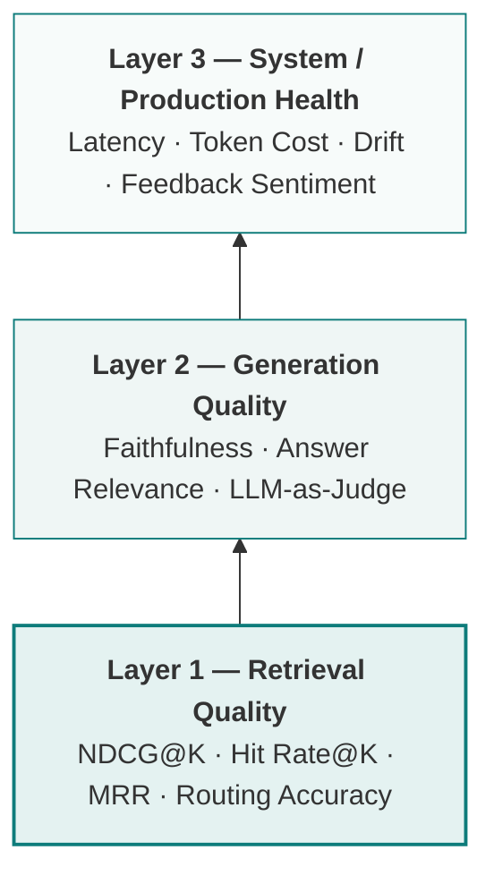
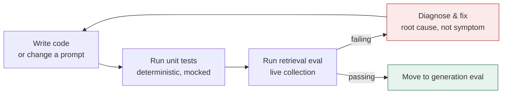
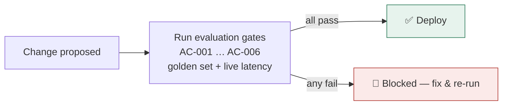
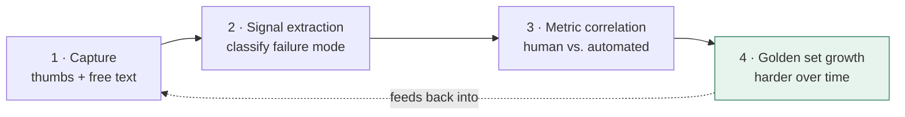
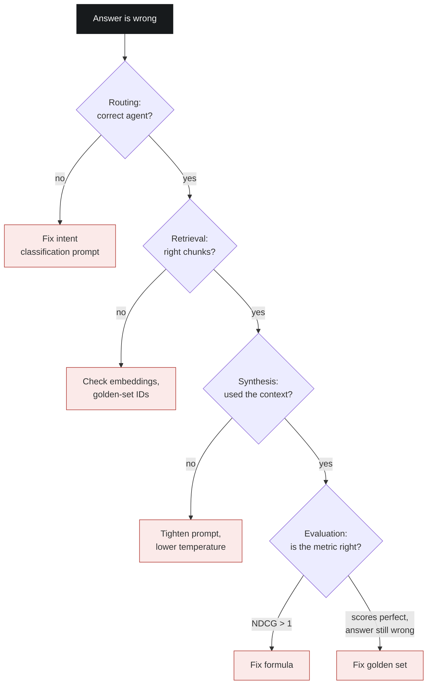

<div class="row"><div class="col-sm mt-3.mt-md-0"></div></div>
<br>
> **How this guide is grounded.** The framework below is written to apply to
> any agentic or RAG system. Where it draws on a real production build —
> **EquipmentIQ**, a multi-agent RAG platform for CNC predictive maintenance —
> that material is marked in a "Case Study" note with a citation, so you can
> tell general practice apart from one project's specific numbers.

📬 Open to freelance and consulting work in agentic AI evaluation, RAG
architecture, and AI trust/compliance tooling — see [Work with me](#work-with-me) at the end.

---

## Contents

1. [Why evaluation is different for agentic AI](#1-why-evaluation-is-different-for-agentic-ai)
2. [The evaluation stack — three layers](#2-the-evaluation-stack--three-layers)
3. [Building ground truth before you build the system](#3-building-ground-truth-before-you-build-the-system)
4. [Development evaluation](#4-development-evaluation)
5. [Pre-deployment gates](#5-pre-deployment-gates)
6. [Continuous production evaluation](#6-continuous-production-evaluation)
7. [The feedback loop — turning users into evaluators](#7-the-feedback-loop--turning-users-into-evaluators)
8. [Common failure modes and how to diagnose them](#8-common-failure-modes-and-how-to-diagnose-them)
9. [The evaluation mindset — key principles](#9-the-evaluation-mindset--key-principles)
10. [Quick reference — metrics cheat sheet](#10-quick-reference--metrics-cheat-sheet)
11. [Appendix — a case study end to end](#appendix--a-case-study-end-to-end)
12. [References & citations](#references--citations)
13. [Work with me](#work-with-me)

---

## 1. Why evaluation is different for agentic AI

Traditional software has deterministic outputs — a function returns the same
result for the same input. Agentic AI systems do not. A multi-agent RAG
system typically has at least five independent sources of non-determinism:

- **Intent classification** — the same query can route to different agents depending on model temperature and prompt phrasing
- **Retrieval** — vector similarity rankings shift as embeddings change or collections are updated
- **Reranking** — cross-encoder scores vary with model version and chunk context
- **Synthesis** — LLM generation is stochastic by nature
- **Feedback loops** — the system changes over time as golden sets grow and prompts are tuned

You cannot test a system like this the way you test regular software. You
need a layered evaluation framework that treats each component as a
measurable subsystem, not a black box.

> Evaluation is not something you add after the system works.
> It is the definition of what "works" means.

> **📎 Case study — EquipmentIQ**
> A system can look finished and still be silently broken. After the agent
> and orchestrator layer of EquipmentIQ was built, the system produced
> plausible answers end to end. Only once a dedicated evaluation pipeline was
> run did five separate defects surface at once: retrieval scoring at zero
> across every collection, a faithfulness metric reading near zero because
> context wasn't reaching the scorer, a ranking formula that mathematically
> couldn't produce the values it was producing, one domain's queries silently
> routing to the wrong agent, and an embedding dimension mismatch between
> ingestion and retrieval. None of these were visible from reading the
> system's output — the answers looked fine. They were only visible once
> evaluation existed as its own subsystem.
> _— Madkour, M., EquipmentIQ project notes, 2026. See [References](#references--citations)._

---

## 2. The evaluation stack — three layers

Every agentic AI system needs evaluation at three distinct layers. Don't
conflate them: they measure different things and require different fixes.



_Fig. 1 — Retrieval is the foundation. Fix it first: a generation-quality problem is often a retrieval problem wearing a different symptom._

### Layer 1 — Retrieval quality

Retrieval is the foundation. A system with poor retrieval cannot produce
good answers regardless of how good the synthesis model is. Fix retrieval
first, always.

### Layer 2 — Generation quality

Once retrieval is correct, measure whether the model is using the retrieved
context faithfully. The critical distinction:

- **High faithfulness, good judge score** → the system is working correctly
- **Low faithfulness, good judge score** → context isn't reaching the scorer — a code bug, not a quality problem
- **High faithfulness, poor judge score** → retrieval is correct but the synthesis prompt needs work
- **Low faithfulness, poor judge score** → both retrieval and synthesis have issues

### Layer 3 — System health

Production systems degrade over time even without code changes. Embedding
drift occurs when query patterns shift away from the indexed document
distribution. Latency increases as collections grow. Token costs rise as
context windows expand. Layer 3 catches these invisible degradations before
users notice them.

> **📎 Case study — EquipmentIQ**
> When one domain's retrieval scored zero, the first suspect was the
> synthesis model. The actual cause was upstream: that domain's queries were
> being routed to a general cross-domain handler instead of its dedicated
> agent, which pulled chunks from every collection and buried the relevant
> ones. Layer-1 evaluation surfaced a routing bug that Layer-2 evaluation
> alone would have hidden — the answers it produced still _read_ fine.
> _— Madkour, M., EquipmentIQ project notes, 2026._

---

## 3. Building ground truth before you build the system

The most common evaluation mistake is building the golden set after the
system is working. That creates circular validation — you tune the system
until it passes tests you wrote while looking at the system's own output.

### Build the golden set first

A golden set is a collection of ground-truth question–answer pairs where
you know the correct answer independently of what your system produces.
A useful starting size is 10 entries per agent or domain, built before a
single evaluation run.

```json
{
  "query": "What is the maximum retry window for a failed webhook delivery?",
  "domain": "api_docs",
  "expected_doc_ids": ["webhooks_retries#3", "webhooks_retries#4"],
  "ground_truth_answer": "Failed webhook deliveries are retried for up to
    24 hours using exponential backoff. After the final attempt, the event
    is marked as failed and must be replayed manually via the events API."
}
```

### The golden set rules

**Rule 1 — Use real data for `expected_doc_ids`.** Never write expected IDs
from memory or documentation. Query your live collection and use the IDs it
actually returns. A golden set written by hand often assumes a clean ID like
`webhooks_retries`, while the collection actually stores chunk-level IDs like
`webhooks_retries#3` or `webhooks_retries_v2_chunk_04`. That mismatch alone
can make every retrieval score come back as zero — not because retrieval
failed, but because the comparison never had a chance to match.

**Rule 2 — Grow the golden set organically from failures.** Every
negatively-rated user query where you know the correct answer becomes a new
golden set entry. This keeps your evaluation aligned with real usage
patterns rather than synthetic test cases.

**Rule 3 — Version control the golden set.** `golden_set.jsonl` lives in your
repository. Every addition goes through a pull request with the new pair and
the evaluation score it produces — this prevents silent degradation when
someone edits the golden set to make a failing test pass.

**Rule 4 — Ten entries per agent is a floor, not a target.** Fewer than 10
entries per domain makes ranking metrics too noisy to trust. At 10 entries, a
single routing failure drops NDCG by 0.10 — detectable, and proportionate. At
3 entries, one failure drops it by 0.33 — which looks catastrophic and can
trigger unnecessary intervention.

> **📎 Case study — EquipmentIQ**
> EquipmentIQ's golden set held 30 Q&A pairs — 10 per agent across a
> three-agent system — built before any evaluation run. Rule 1 was learned
> the hard way: early entries used clean IDs like `DOC-EIQ-001`, while the
> vector store stored chunk-level IDs such as
> `DOC-EIQ-001_Machine_Overview_chunk_3`. Every retrieval score came back at
> zero until the golden set was rebuilt from a live query against the
> collection.
> _— Madkour, M., EquipmentIQ project notes, 2026._

---

## 4. Development evaluation

During development, evaluation serves a different purpose than it does in
production: the goal is to make retrieval and routing deterministic before
worrying about generation quality at all.



_Fig. 2 — Never skip to generation evaluation while retrieval is still failing: from the outside, retrieval bugs and generation bugs look identical._

### Unit tests vs. evaluation tests

| Unit tests                 | Evaluation tests              |
| -------------------------- | ----------------------------- |
| Test code correctness      | Test system quality           |
| Deterministic pass/fail    | Probabilistic thresholds      |
| Run in milliseconds        | Take seconds to minutes       |
| Run on every commit        | Run on a schedule or trigger  |
| Mock external dependencies | Use real collections and APIs |

### The NDCG formula — get it right

NDCG (Normalized Discounted Cumulative Gain) is the standard retrieval
quality metric. A common implementation bug uses `1/(i+1)` instead of
`1/log₂(rank+1)`, which can produce values above 1.0 — a mathematically
impossible result that signals a formula error, not a great system. The
corrected, standalone implementation:

```python
# retrieval_metrics.py
import math

def ndcg_at_k(retrieved_ids, expected_ids, k=5):
    """
    Normalized Discounted Cumulative Gain at rank k.
    retrieved_ids: ordered list of document/chunk IDs returned by the retriever
    expected_ids:  set (or list) of IDs known to be relevant, from the golden set
    """
    dcg = 0.0
    for rank, doc_id in enumerate(retrieved_ids[:k], start=1):
        relevance = 1.0 if doc_id in expected_ids else 0.0
        dcg += relevance / math.log2(rank + 1)

    # Ideal DCG: all relevant docs occupy the top positions
    n_relevant = min(len(expected_ids), k)
    idcg = sum(1.0 / math.log2(rank + 1) for rank in range(1, n_relevant + 1))

    if idcg == 0:
        return 0.0

    return min(1.0, dcg / idcg)  # clamp — any value above 1.0 is a formula bug
```

Always add the hard clamp to `[0.0, 1.0]` as a safety net.

### Routing accuracy — the overlooked metric

In a multi-agent system, routing accuracy matters as much as retrieval
quality. A query routed to the wrong agent produces a confidently wrong
answer — often more harmful than no answer at all. A reasonable target is
95% accuracy across a labelled set of roughly 10 queries per domain.

When routing degrades, resist the temptation to fix it by lowering the
confidence threshold — that just redistributes ambiguous queries to
arbitrary agents instead of resolving the ambiguity. Fix it by adding
explicit examples and disambiguating rules to the classification prompt.

### Embedding consistency — the silent killer

Ingestion, retrieval, and evaluation must all use identical embedding
configuration: same model, same dimensions, same distance metric. A common
and completely silent failure mode is ingesting with one embedding model
(say, a 1536-dimension model) and retrieving with a vector store's different
default (say, a 384-dimension model) — every query then fails a dimension
check and returns empty results, with no visible error in the generated
answer.

```python
# embeddings.py — one client, everywhere
# Define the embedding function once and reuse it for ingestion,
# retrieval, and evaluation — never let two code paths choose their own default.

from chromadb.utils import embedding_functions

embedder = embedding_functions.OpenAIEmbeddingFunction(
    api_key="...",
    model_name="text-embedding-3-small",
)

collection = client.get_or_create_collection(
    name="docs",
    embedding_function=embedder,          # same embedder used at query time
    metadata={"hnsw:space": "cosine"},    # explicit distance metric
)
```

> **📎 Case study — EquipmentIQ**
> EquipmentIQ maintained 91 unit tests running in under 60 seconds with all
> external dependencies mocked, alongside a separate evaluation suite that ran
> against live ChromaDB collections and real API calls. Its own NDCG bug
> matched the formula error above exactly — the corrected version shown here
> is the fix that shipped. Its routing bug came from a support domain being
> confused with a general-purpose fallback, resolved by adding explicit
> disambiguating examples rather than touching the confidence threshold.
> _— Madkour, M., EquipmentIQ project notes, 2026._

---

## 5. Pre-deployment gates

Before any change goes to production — a new prompt, a new chunk size, a new
model, new documents — the system should pass a set of numerical gates. A
typical gate set:

| Gate   | Metric                    | Target | On failure       |
| ------ | ------------------------- | ------ | ---------------- |
| AC-001 | NDCG@5 per domain         | ≥ 0.70 | 🔴 Blocks deploy |
| AC-002 | Hit Rate@5 per domain     | ≥ 0.85 | 🔴 Blocks deploy |
| AC-003 | Faithfulness (RAGAS)      | ≥ 0.80 | 🔴 Blocks deploy |
| AC-004 | Routing accuracy          | ≥ 95%  | 🔴 Blocks deploy |
| AC-005 | P95 latency, single agent | ≤ 10s  | 🔴 Blocks deploy |
| AC-006 | P95 latency, cross-domain | ≤ 20s  | 🟡 Advisory      |



_Fig. 3 — Gates run as part of CI, not as a manual checklist someone remembers to run._

The batch evaluation runner exits with a non-zero status when any gate
fails, which is what allows it to block a CI/CD pipeline:

```python
# batch_eval.py — CI gate
import sys

NDCG_GATE = 0.70
FAITHFULNESS_GATE = 0.80
ROUTING_GATE = 0.95

def run_gates(results: dict) -> int:
    """
    results: {"ndcg": {domain: score, ...}, "faithfulness": score, "routing": score}
    Returns process exit code — 0 if every gate passes, 1 otherwise.
    """
    failures = []

    for domain, ndcg in results["ndcg"].items():
        if ndcg < NDCG_GATE:
            failures.append(f"NDCG gate FAIL ({domain}): {ndcg:.3f} < {NDCG_GATE}")

    if results["faithfulness"] < FAITHFULNESS_GATE:
        failures.append(f"Faithfulness gate FAIL: {results['faithfulness']:.3f} < {FAITHFULNESS_GATE}")

    if results["routing"] < ROUTING_GATE:
        failures.append(f"Routing gate FAIL: {results['routing']:.3f} < {ROUTING_GATE}")

    if failures:
        for f in failures:
            print(f"  - {f}")
        return 1  # blocks deployment

    print("All gates passed.")
    return 0

if __name__ == "__main__":
    sys.exit(run_gates(load_latest_results()))
```

### Calibrating the gates

Start with conservative targets (NDCG ≥ 0.60, faithfulness ≥ 0.70) and raise
them as the system matures. Targets set too high initially block legitimate
deployments; set too low, the gates never catch a real problem. A workable
pattern is to calibrate the first gate against your golden set's baseline
score, then tighten it once the system is stable — for example, once a
domain reliably scores 1.00 on NDCG, its gate can move from 0.70 to 0.85 to
catch regressions more sensitively.

---

## 6. Continuous production evaluation

Production evaluation serves a different purpose than development
evaluation. The goal isn't to verify the system works — it's to detect when
it stops working, before users notice.

Not all evaluation is equal in cost. Run cheap checks constantly and
expensive ones on a schedule:

| Tier              | Frequency                    | What runs                             | Cost per run |
| ----------------- | ---------------------------- | ------------------------------------- | ------------ |
| Real-time         | Every query                  | Latency, routing domain, chunk count  | $0.00        |
| Sampled online    | 10–15% of traffic            | Faithfulness, LLM-as-Judge            | ~$0.004      |
| Triggered         | On every feedback submission | Signal extraction, metric correlation | ~$0.001      |
| Nightly batch     | Daily                        | NDCG, MRR, drift detection            | ~$0.02       |
| Weekly regression | Weekly                       | Full golden set evaluation            | ~$0.10       |
| On deployment     | Every code/prompt change     | Full golden set, latency              | ~$0.10       |

### Embedding drift detection

Embedding drift occurs when the distribution of production queries shifts
away from the distribution of your indexed documents — a natural effect of
usage patterns evolving past what the system was originally built for.

```python
# drift_monitor.py
import numpy as np

def compute_centroid(collection):
    """Mean embedding vector across every item in a vector store collection."""
    all_embeddings = collection.get(include=["embeddings"])["embeddings"]
    return np.mean(all_embeddings, axis=0)

def detect_drift(collection, baseline_path, threshold=0.15):
    """
    Compares the current collection centroid to a saved baseline.
    Save a new baseline (np.save) after every intentional collection update.
    """
    current = compute_centroid(collection)
    baseline = np.load(baseline_path)

    similarity = np.dot(current, baseline) / (
        np.linalg.norm(current) * np.linalg.norm(baseline)
    )
    drift = 1 - similarity
    return {"drift": float(drift), "alert": drift > threshold}
```

### Observability — what to read in a trace

Every production query should produce a trace with named spans for each step
in the pipeline:

```text
run_query                          1.2s total
├── classify_intent                  85ms   domain=billing confidence=0.94
├── retrieve                        340ms   chunks=5 top_score=0.87
├── merge_context                     2ms   deduped=5
├── synthesize                      780ms   tokens_in=1240 tokens_out=312
└── log_trace                         1ms   citations=3
```

What to watch for: intent-classification confidence consistently below 0.75
(the prompt needs more examples for those patterns), an agent returning zero
chunks (embedding drift or a collection issue), synthesis latency climbing
past a few seconds (context window too large — reduce top-k), or every query
landing in a generic fallback domain (confidence threshold needs
recalibration).

---

## 7. The feedback loop — turning users into evaluators

Human feedback is the most valuable signal in any AI system, because it
captures something automated metrics cannot: whether the answer was
actually useful for the user's specific situation.



_Fig. 4 — Every negatively-rated query with a known correct answer becomes tomorrow's golden set entry._

**Stage 1 — Capture.** Every response gets an optional feedback widget.
Store, at minimum, the query, the agent routed, the generated answer, the
retrieved chunk IDs, and any automated scores already computed for that
query.

```python
# feedback.py — capture schema
from dataclasses import dataclass, field
from datetime import datetime, timezone

@dataclass
class FeedbackRecord:
    query: str
    domain: str
    answer: str
    retrieved_ids: list[str]
    rating: str                    # "up" | "down"
    comment: str | None = None
    automated_scores: dict = field(default_factory=dict)
    timestamp: str = field(default_factory=lambda: datetime.now(timezone.utc).isoformat())
```

**Stage 2 — Signal extraction.** Raw free-text feedback is noisy. Run it
through a small classification step to extract structured signal:

- `wrong_answer` — factually incorrect
- `incomplete` — partially correct, missing key information
- `hallucinated` — contains information not in the retrieved context
- `out_of_scope` — the system answered a question it should have declined
- `correct` — accurate and complete

**Stage 3 — Metric correlation.** Compare human ratings against automated
scores for the same queries. A negative human rating paired with a high
automated faithfulness score is a discordant case worth investigating: if
users dislike answers that score well on faithfulness, the metric may be
measuring "grounded" when the real problem is "incomplete." If users like
answers that score poorly, the scorer likely has a bug. A discordant rate
above 20% is a signal to audit your automated metrics, not your product.

**Stage 4 — Golden set growth.** Every negatively-rated query with a known
correct answer becomes a new golden set entry — the compounding, long-term
benefit of collecting user feedback at all.

> Human feedback is the calibration layer for automated metrics,
> not a replacement for them.

---

## 8. Common failure modes and how to diagnose them

Use this as a debugging playbook. Each pattern below recurs across different
RAG and multi-agent stacks — only the surface symptom changes.



_Fig. 5 — Work top to bottom. A generation fix applied while retrieval is still broken will not hold._

### Failure — a ranking metric scores zero across the board

**Symptom:** Every query scores zero regardless of how good retrieval looks
on manual inspection.
**Diagnosis:** The golden set's expected document IDs don't match the actual
IDs in the collection — almost always a format mismatch, e.g. a clean ID in
the golden set versus a chunk-suffixed ID in the store.
**Fix:** Query each collection for each golden entry and replace the
expected IDs with whatever the collection actually returns.
**Prevention:** Never write expected IDs from memory — always extract them
from a live query.

### Failure — NDCG above 1.0

**Symptom:** A mathematically impossible score, like 1.28.
**Diagnosis:** The DCG formula is using `1/(i+1)` instead of `1/log₂(rank+1)`.
**Fix:** Use the corrected formula (Section 4) and add a hard clamp to `[0.0, 1.0]`.

### Failure — faithfulness near zero but a judge model rates the answers highly

**Symptom:** Faithfulness and judge scores contradict each other — the judge
thinks the answers are good, faithfulness says they're ungrounded.
**Diagnosis:** The faithfulness scorer is receiving empty context or the
wrong object type. It reports 0.0 because it sees no supporting evidence, not
because the answers are actually unfaithful — a code bug, not a quality
problem.
**Fix:** Add a debug print before the scoring call to inspect the type and
content of the context argument. Common causes: an empty list where merged
context should be; retrieval result objects passed in place of plain
strings; a scoring library failing silently against a non-default model
provider.

### Failure — an ambiguous domain routes to the wrong handler

**Symptom:** One domain's retrieval metric is very low or zero, and
inspection shows its queries being classified into a general fallback
instead of their dedicated agent.
**Diagnosis:** The intent classifier lacks enough examples for that domain.
A query like "this isn't working the way it should" is genuinely ambiguous —
it could be a technical fault report or a support complaint, and the
classifier has no strong signal either way.
**Fix:** Add explicit examples to the classification prompt and a
categorical rule for the domain's distinguishing vocabulary (case numbers,
remedy requests, specific ID formats). Don't lower the confidence threshold
as a substitute.

### Failure — embedding dimension mismatch

**Symptom:** Retrieval returns empty results, or raises a dimension mismatch
error silently.
**Diagnosis:** Ingestion and retrieval are using different embedding clients
— a common trap when one code path defaults to a vector store's built-in
embedder while another explicitly configures a different model.
**Fix:** Use one embedding client throughout, passed explicitly to every
collection call (see Section 4).

### Failure — routing accuracy regresses after a prompt update

**Symptom:** Previously correct routing decisions start failing after a
change to the intent classification prompt.
**Diagnosis:** The prompt change removed examples that were implicitly
disambiguating edge cases, and the routing test set wasn't comprehensive
enough to catch the regression.
**Fix:** Maintain a labelled routing test set (roughly 10 queries per
domain) that runs automatically after every prompt change, and treat routing
accuracy as a hard gate rather than a metric you check occasionally.

---

## 9. The evaluation mindset — key principles

**Evaluate the right layer first.** Retrieval → routing → generation →
system health. Always in this order. Generation problems are invisible when
retrieval is broken. Routing problems cause retrieval problems. System
health problems cause everything else eventually.

**Your automated metrics are only as good as your ground truth.** An NDCG
of 1.00 means nothing if the expected document IDs are wrong. An LLM-judge
score of 4.5/5 means nothing if the judge prompt is poorly calibrated. A
faithfulness score of 0.90 means nothing if the scorer is receiving empty
context. Validate your evaluation framework before you trust its output.

**Human feedback calibrates automated metrics.** Don't replace human
feedback with automated metrics — use them together. Automated metrics
scale to all traffic; human feedback reveals when automated metrics are
measuring the wrong thing. When they disagree, investigate — never assume
the automated metric is the one that's right.

**Fix root causes, not symptoms.** When a ranking metric is low, the
temptation is to lower the threshold. When routing is wrong, the temptation
is to adjust the confidence threshold. Both are symptom fixes. The root
causes — golden set ID mismatches, thin prompt examples, embedding
inconsistency — keep causing problems long after the threshold has been
adjusted.

**Evaluation infrastructure is production code.** Treat your metrics
module, batch evaluation runner, and golden set with the same engineering
rigor as your agent code: unit tests, version control, code review. An
evaluation bug is as damaging as a production bug, because it gives you
false confidence.

**Commit after every green evaluation run.** The moment all gates pass,
commit. Evaluation results are ephemeral — the next change might break
something. A git history where every commit has a passing evaluation gives
you clean rollback points and a record of exactly when a degradation was
introduced.

---

## 10. Quick reference — metrics cheat sheet

### Retrieval metrics

| Metric     | Formula                                | Interpretation                                     | Target |
| ---------- | -------------------------------------- | -------------------------------------------------- | ------ |
| NDCG@K     | DCG / IDCG, DCG = Σ rel / log₂(rank+1) | Ranking quality — rewards relevant docs at the top | ≥ 0.70 |
| Hit Rate@K | 1 if any expected doc in top K, else 0 | Binary — did we find anything relevant?            | ≥ 0.85 |
| MRR        | 1 / rank of first relevant result      | How high is the first correct answer?              | ≥ 0.60 |

### Generation metrics

| Metric           | What it measures                      | Tool                    | Target    |
| ---------------- | ------------------------------------- | ----------------------- | --------- |
| Faithfulness     | Are claims grounded in context?       | RAGAS or LLM-as-Judge   | ≥ 0.80    |
| Answer Relevance | Does the answer address the question? | RAGAS                   | ≥ 0.75    |
| LLM-as-Judge     | Overall quality, 1–5 rubric           | Separate model instance | ≥ 3.5 / 5 |

```python
# llm_judge.py — standalone scorer
import json

JUDGE_PROMPT = """You are grading an AI assistant's answer for a support system.

Question: {question}
Retrieved context: {context}
Answer to grade: {answer}

Score the answer from 1-5 on:
- Groundedness: is every claim supported by the retrieved context?
- Completeness: does it fully address the question?
- Clarity: would the intended reader understand it without follow-up?

Respond with only a JSON object: {{"score": <1-5>, "reasoning": "<one sentence>"}}
"""

def llm_as_judge(question, context, answer, client, model="your-judge-model"):
    """
    `client` is any chat-completion client exposing a .complete(prompt) -> str
    method. Swap in your provider of choice; the grading logic is provider-agnostic.
    """
    prompt = JUDGE_PROMPT.format(question=question, context=context, answer=answer)
    response = client.complete(prompt, temperature=0.0)
    return json.loads(response)
```

### System health metrics

| Metric                    | What it measures                               | Alert threshold |
| ------------------------- | ---------------------------------------------- | --------------- |
| Embedding drift           | Cosine distance, current vs. baseline centroid | > 0.15          |
| P95 latency, single agent | 95th percentile end-to-end response time       | > 10s           |
| P95 latency, cross-domain | 95th percentile for parallel retrieval         | > 20s           |
| Routing accuracy          | % of queries routed to the correct agent       | < 95%           |
| Discordant rate           | % negative feedback with high automated scores | > 20%           |

---

## Appendix — a case study end to end

Every principle above is written to generalize. This appendix is the one
place in the guide where a single project's actual numbers are shown in
full, so you can see how the framework reads against a real system rather
than an idealized one.

**EquipmentIQ** is a production-grade multi-agent RAG system for CNC
machinery predictive maintenance, built across three domain agents on top of
the Bosch CNC Machining Dataset — 1,702 real vibration recordings from three
brownfield milling machines, covering 70 real fault events, released under
CC BY 4.0 (Tnani, Feil & Diepold, 2022 — see [References](#references--citations)).
The stack: LangGraph for orchestration, ChromaDB across three isolated
collections, OpenAI embeddings, an Anthropic Claude model for both synthesis
and as an evaluation judge, RAGAS for generation metrics, and LangSmith for
tracing.

| Metric                | Value           | Gate     | Status                                     |
| --------------------- | --------------- | -------- | ------------------------------------------ |
| Mechanical NDCG@5     | 1.00            | ≥ 0.70   | ✅ PASS                                    |
| Software NDCG@5       | 1.00            | ≥ 0.70   | ✅ PASS                                    |
| Support NDCG@5        | 1.00            | ≥ 0.70   | ✅ PASS                                    |
| Mechanical Hit Rate@5 | 1.00            | ≥ 0.85   | ✅ PASS                                    |
| Software Hit Rate@5   | 1.00            | ≥ 0.85   | ✅ PASS                                    |
| Support Hit Rate@5    | 1.00            | ≥ 0.85   | ✅ PASS                                    |
| MRR@5                 | 0.966           | ≥ 0.60   | ✅ PASS                                    |
| Routing accuracy      | 91.9% (34/37)   | ≥ 95%    | 🟡 Close — support routing itself was 100% |
| Embedding drift       | 0.00 (baseline) | < 0.15   | ✅ PASS                                    |
| Unit tests            | 85 / 97         | All pass | 🟡 12 integration tests pending live API   |

Eight distinct bugs surfaced and were resolved across the project's
lifecycle — spanning the ID-mismatch, NDCG-formula, faithfulness-context, and
routing-ambiguity patterns described in Section 8, plus a document
re-indexing gap and a dashboard logging bug that showed all-zero results
because a results-saving call was missing entirely. Two things worth naming
honestly, since a portfolio piece that only reports clean wins isn't a
useful reference: a data gap assessment found real discrepancies between the
dataset's documentation and its actual behavior — some fault cycles scored
contrary to what the documentation implied, and coverage of certain anomaly
types in real recordings was thin — and the knowledge base used for
retrieval is domain-authentic synthetic text layered on top of the dataset's
real sensor recordings, not a natively text-based source. Both are disclosed
here rather than smoothed over, in keeping with Section 9's principle that
your evaluation is only as trustworthy as your honesty about its ground
truth.

---

## References & citations

- **[Dataset]** Tnani, M.-A., Feil, M., & Diepold, K. (2022). _Smart Data
  Collection System for Brownfield CNC Milling Machines: A New Benchmark
  Dataset for Data-Driven Machine Monitoring._ Procedia CIRP, 107, 131–136.
  DOI: [10.1016/j.procir.2022.04.022](https://doi.org/10.1016/j.procir.2022.04.022).
  Dataset released under CC BY 4.0 at
  [github.com/boschresearch/CNC_Machining](https://github.com/boschresearch/CNC_Machining).
- **[Framework]** Es, S., James, J., Espinosa Anke, L., & Schockaert, S.
  (2024). _RAGAs: Automated Evaluation of Retrieval Augmented Generation._
  Proceedings of the EACL 2024 System Demonstrations. Project:
  [github.com/explodinggradients/ragas](https://github.com/explodinggradients/ragas).
- **[Metric]** Järvelin, K., & Kekäläinen, J. (2002). _Cumulated Gain-Based
  Evaluation of IR Techniques._ ACM Transactions on Information Systems,
  20(4), 422–446. — the original definition of NDCG referenced in
  Sections 4 and 10.
- **[Tooling]** LangGraph (agent orchestration) and LangSmith
  (tracing/observability), LangChain, Inc. —
  [langchain-ai.github.io/langgraph](https://langchain-ai.github.io/langgraph/)
  and [smith.langchain.com](https://smith.langchain.com/).
- **[Project]** Madkour, M. _EquipmentIQ: a multi-agent RAG system for CNC
  predictive maintenance._ Portfolio project, 2026 — the source of every
  "Case Study" note in this guide, including the Appendix. Code and
  write-ups available on request via
  [github.com/mohcinemadkour](https://github.com/mohcinemadkour).

---

## Work with me

I'm Mohcine Madkour, PhD — a Senior AI/ML Engineer and Architect with 13+
years across clinical AI, surgical robotics, and industrial IoT. I build and
evaluate agentic AI and RAG systems the way this guide describes: gated,
monitored, and honest about their failure modes. I'm currently building
[EvalTrust](https://evaltrust.cloud), an AI evaluation and trust platform
for regulated industries — and I take on freelance and consulting
engagements in agentic AI evaluation, RAG system architecture, and AI
trust/compliance tooling.

Background: postdoctoral research in Biomedical Informatics at UTHealth
Houston; predictive-maintenance MLOps for the da Vinci surgical robot fleet
at Intuitive Surgical; connected-diagnostics IoT at Cummins / PreventTech.
PhD, University of Mohammed V Agdal; MSc, Télécom Bretagne. Based in the
Dallas–Fort Worth area.

- ✉️ Email: [mohcine.madkour@gmail.com](mailto:mohcine.madkour@gmail.com)
- 💼 LinkedIn: [linkedin.com/in/mohcine-madkour-83a642b2](https://www.linkedin.com/in/mohcine-madkour-83a642b2)
- 🖥️ GitHub: [github.com/mohcinemadkour](https://github.com/mohcinemadkour)
- ◈ EvalTrust: [evaltrust.cloud](https://evaltrust.cloud)

---

_Guide written by Mohcine Madkour, PhD. Numbers in the Appendix and every
"Case Study" note are specific to the EquipmentIQ project and cited above;
the rest of the guide is written to apply to any agentic AI or RAG system._
