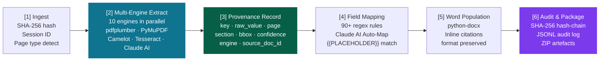

<div class="row mb-2">
  <div class="col-sm-12">
    <span class="badge bg-danger me-1">Regulatory AI</span>
    <span class="badge bg-secondary me-1">Document Intelligence</span>
    <span class="badge bg-secondary me-1">21 CFR Part 11</span>
    <span class="badge bg-secondary me-1">Available Now</span>
  </div>
</div>

---

## Overview

An end-to-end Python platform that extracts structured data from regulatory PDFs — **CSRs, AE summaries, CoAs, stability reports, WHO monographs** — and populates Word templates with inline source citations. Every extracted value is tagged with its source filename, page number, and section header. The entire data journey is reproducible, auditable, and GMP-ready.

<div class="row my-4">
  <div class="col-6 col-md-3 text-center">
    <div class="p-3 rounded" style="background:var(--global-card-bg, #f8f9fa); border: 1px solid var(--global-divider-color, #dee2e6);">
      <div class="fw-bold text-info" style="font-size:2.4rem; line-height:1; font-family:Georgia,serif;">10+</div>
      <small class="text-muted d-block mt-1">Extraction Engines</small>
    </div>
  </div>
  <div class="col-6 col-md-3 text-center">
    <div class="p-3 rounded" style="background:var(--global-card-bg, #f8f9fa); border: 1px solid var(--global-divider-color, #dee2e6);">
      <div class="fw-bold text-info" style="font-size:2.4rem; line-height:1; font-family:Georgia,serif;">530+</div>
      <small class="text-muted d-block mt-1">Fields from One PDF</small>
    </div>
  </div>
  <div class="col-6 col-md-3 text-center">
    <div class="p-3 rounded" style="background:var(--global-card-bg, #f8f9fa); border: 1px solid var(--global-divider-color, #dee2e6);">
      <div class="fw-bold text-info" style="font-size:2.4rem; line-height:1; font-family:Georgia,serif;">100%</div>
      <small class="text-muted d-block mt-1">Source Citations</small>
    </div>
  </div>
  <div class="col-6 col-md-3 text-center">
    <div class="p-3 rounded" style="background:var(--global-card-bg, #f8f9fa); border: 1px solid var(--global-divider-color, #dee2e6);">
      <div class="fw-bold text-info" style="font-size:2.4rem; line-height:1; font-family:Georgia,serif;">21 CFR</div>
      <small class="text-muted d-block mt-1">Part 11 Aligned</small>
    </div>
  </div>
</div>

<div class="row mt-3 mb-2">
  <div class="col-sm-12">
    <a class="btn btn-sm btn-primary me-2" href="https://youtu.be/pKZQgWofWwc" target="_blank" rel="noopener">▶ Watch the walkthrough</a>
    <a class="btn btn-sm btn-outline-secondary me-2" href="https://github.com/mohcinemadkour/PDF-AS-DATA" target="_blank" rel="noopener">View the code</a>
    <a class="btn btn-sm btn-outline-secondary" href="mailto:mohcine.madkour@gmail.com?subject=PDFD%20Platform%20Inquiry">Contact me</a>
  </div>
</div>

---

## Video Walkthrough

<div class="ratio ratio-16x9 mb-2">
  <iframe src="https://www.youtube.com/embed/pKZQgWofWwc" title="Pharma PDF Extraction & Audit Traceability Platform" allow="accelerometer; autoplay; clipboard-write; encrypted-media; gyroscope; picture-in-picture; web-share" allowfullscreen></iframe>
</div>

---

## System Architecture — End-to-End Pipeline

Each stage produces verifiable artefacts (provenance records, audit JSONL, populated `.docx`) so the entire data journey is reproducible and inspectable.



### Stage Details

| Stage                        | What It Does                                                                                                                                                                                                                 |
| ---------------------------- | ---------------------------------------------------------------------------------------------------------------------------------------------------------------------------------------------------------------------------- |
| **[1] Ingest**               | SHA-256 hashes each PDF. Detects native-text vs. scanned pages via pdfplumber. Assigns session ID and `source_doc_id`. Records file metadata.                                                                                |
| **[2] Multi-Engine Extract** | Runs up to 10 engines in parallel: pdfplumber (KV + tables), PyMuPDF (metadata), Camelot/Tabula (bordered tables), Tesseract OCR (scanned), AWS Textract, Azure Form Recognizer, AcroForm parser, Claude 3.5 Sonnet, GPT-4o. |
| **[3] Provenance Record**    | Every extracted value becomes a structured record with `key`, `raw_value`, `page_number`, `section_header`, `bounding_box`, `confidence_score`, `extraction_engine`, and `source_doc_id`.                                    |
| **[4] Field Mapping**        | 90+ regex rules + Claude AI Auto-Map match provenance records to `{{PLACEHOLDER}}` fields in Word templates. Every match and miss is logged.                                                                                 |
| **[5] Word Population**      | python-docx replaces each `{{FIELD}}` with `"value [Src: filename.pdf, p.N, Section: Header]"`. Preserves template formatting, fonts, and table structure.                                                                   |
| **[6] Audit & Package**      | SHA-256 hash-chained JSONL audit log (one entry per mapped field). 7-section human-readable audit report PDF. ZIP package of all artefacts.                                                                                  |

---

## Provenance Record Schema

Every single extracted value is a structured, traceable record:

```python
ProvenanceRecord {
  field_id         : UUID    # unique per extraction
  key              : str     # field name (e.g. 'Total Impurities')
  raw_value        : str     # extracted text exactly as in PDF
  normalized_value : str | None  # cleaned / unit-converted value
  page_number      : int     # 1-based PDF page
  section_header   : str     # nearest heading above the value
  bounding_box     : {x0,y0,x1,y1}  # PDF-point coords for highlighting
  confidence_score : float   # 0.0 – 1.0
  extraction_engine: str     # pdfplumber | camelot | claude | ...
  source_doc_id    : str     # SHA-256 of source PDF
  record_type      : str     # kv | table | acroform | llm | ocr
}
```

---

## Extraction Quality — Citation Examples

### Certificate of Analysis

| Field              | Extracted Value | Word Template Output                                                   |
| ------------------ | --------------- | ---------------------------------------------------------------------- |
| Assay (HPLC)       | 98.7 %          | `98.7 % [Src: CoA_Batch2024.pdf, p.3, Sec: 2.1 Assay Results]`         |
| Total Impurities   | 0.42 %          | `0.42 % [Src: CoA_Batch2024.pdf, p.3, Sec: 2.2 Impurity Profile]`      |
| Water Content (KF) | 0.18 %          | `0.18 % [Src: CoA_Batch2024.pdf, p.4, Sec: 2.3 Physical Tests]`        |
| Microbial Limit    | < 100 CFU/g     | `< 100 CFU/g [Src: CoA_Batch2024.pdf, p.4, Sec: 2.4 Microbiological]`  |
| Batch Number       | AXV-2024-0042   | `AXV-2024-0042 [Src: CoA_Batch2024.pdf, p.1, Sec: 1.0 Identification]` |

### Stability Report

| Field                 | Extracted Value        | Word Template Output                                                           |
| --------------------- | ---------------------- | ------------------------------------------------------------------------------ |
| Storage Condition     | 25°C / 60% RH          | `25°C / 60% RH [Src: Stability_AXV101.pdf, p.2, Sec: 3.1 ICH Conditions]`      |
| T=12 months Assay     | 97.9 %                 | `97.9 % [Src: Stability_AXV101.pdf, p.5, Sec: 4.2 Assay Data]`                 |
| Degradation Product A | 0.09 %                 | `0.09 % [Src: Stability_AXV101.pdf, p.5, Sec: 4.3 Degradants]`                 |
| Retest Date           | 2026-08                | `2026-08 [Src: Stability_AXV101.pdf, p.2, Sec: 2.1 Shelf Life]`                |
| Conclusion            | Meets ICH Q1A criteria | `Meets ICH Q1A criteria [Src: Stability_AXV101.pdf, p.9, Sec: 6.0 Conclusion]` |

---

## Before & After — Word Template Population

<div class="row mt-3">
  <div class="col-md-5 mb-3">
    <div class="card h-100 border-secondary">
      <div class="card-header bg-secondary text-white fw-bold small">BEFORE — Word template placeholders</div>
      <div class="card-body">
        <pre class="mb-0" style="font-size:.82rem; background:transparent; border:none; padding:0;"><code>Batch Number:      {{BATCH_NUMBER}}
Assay Result:      {{ASSAY_RESULT}}
Total Impurities:  {{TOTAL_IMPURITIES}}
Retest Date:       {{RETEST_DATE}}
Approved By:       {{QA_APPROVER}}</code></pre>
      </div>
    </div>
  </div>
  <div class="col-md-1 d-flex align-items-center justify-content-center">
    <span style="font-size:1.8rem; color:var(--global-theme-color, #0E7490);">→</span>
  </div>
  <div class="col-md-6 mb-3">
    <div class="card h-100 border-success">
      <div class="card-header bg-success text-white fw-bold small">AFTER — Populated with inline citations</div>
      <div class="card-body">
        <pre class="mb-0" style="font-size:.82rem; background:transparent; border:none; padding:0;"><code>Batch Number:     AXV-2024-0042 [Src: CoA_Batch2024.pdf, p.1]
Assay Result:     98.7 % [Src: CoA_Batch2024.pdf, p.3, Sec: 2.1]
Total Impurities: 0.42 % [Src: CoA_Batch2024.pdf, p.3, Sec: 2.2]
Retest Date:      2026-08 [Src: Stability_AXV101.pdf, p.2]
Approved By:      Dr. J. Smith [Src: CoA_Batch2024.pdf, p.1]</code></pre>
      </div>
    </div>
  </div>
</div>

---

## Technology Stack

<div class="row mt-2">
  <div class="col-md-6 mb-3">
    <h6 class="fw-bold text-muted text-uppercase" style="font-size:.75rem; letter-spacing:.1em;">Extraction Layer</h6>
    <table class="table table-sm table-borderless mb-0" style="font-size:.9rem;">
      <tbody>
        <tr><td class="fw-bold text-info" style="width:40%">pdfplumber</td><td class="text-muted">Native text, table KV, two-column layout detection</td></tr>
        <tr><td class="fw-bold text-info">PyMuPDF</td><td class="text-muted">PDF metadata, fast page rendering, info-dict</td></tr>
        <tr><td class="fw-bold text-info">Camelot / Tabula</td><td class="text-muted">Bordered & stream table extraction (Java-backed)</td></tr>
        <tr><td class="fw-bold text-info">Tesseract OCR</td><td class="text-muted">Local OCR for scanned / image-only pages</td></tr>
        <tr><td class="fw-bold text-info">AWS Textract</td><td class="text-muted">Cloud OCR with table/form structure (optional)</td></tr>
        <tr><td class="fw-bold text-info">Azure Form Recognizer</td><td class="text-muted">Pre-built pharma/invoice models (optional)</td></tr>
        <tr><td class="fw-bold text-info">AcroForm parser</td><td class="text-muted">Interactive PDF form fields, checkboxes, dropdowns</td></tr>
      </tbody>
    </table>
  </div>
  <div class="col-md-6 mb-3">
    <h6 class="fw-bold text-muted text-uppercase" style="font-size:.75rem; letter-spacing:.1em;">LLM Layer</h6>
    <table class="table table-sm table-borderless mb-0" style="font-size:.9rem;">
      <tbody>
        <tr><td class="fw-bold text-info" style="width:40%">Claude 3.5 Sonnet</td><td class="text-muted">Schema-driven field extraction, Q&A, Auto-Map</td></tr>
        <tr><td class="fw-bold text-info">GPT-4o</td><td class="text-muted">Alternative LLM for extraction comparison</td></tr>
      </tbody>
    </table>
    <h6 class="fw-bold text-muted text-uppercase mt-3" style="font-size:.75rem; letter-spacing:.1em;">Document Generation</h6>
    <table class="table table-sm table-borderless mb-0" style="font-size:.9rem;">
      <tbody>
        <tr><td class="fw-bold text-info" style="width:40%">python-docx</td><td class="text-muted">Template population, inline citation insertion</td></tr>
        <tr><td class="fw-bold text-info">fpdf2</td><td class="text-muted">Audit report PDF generation</td></tr>
      </tbody>
    </table>
    <h6 class="fw-bold text-muted text-uppercase mt-3" style="font-size:.75rem; letter-spacing:.1em;">API / Compliance</h6>
    <table class="table table-sm table-borderless mb-0" style="font-size:.9rem;">
      <tbody>
        <tr><td class="fw-bold text-info" style="width:40%">FastAPI + Uvicorn</td><td class="text-muted">REST API, auth, rate-limiting, CORS</td></tr>
        <tr><td class="fw-bold text-info">SHA-256 hash chain</td><td class="text-muted">Tamper-evident JSONL audit log</td></tr>
        <tr><td class="fw-bold text-info">21 CFR Part 11</td><td class="text-muted">Electronic record / e-signature alignment</td></tr>
        <tr><td class="fw-bold text-info">React + TypeScript</td><td class="text-muted">Dashboard: upload, extract, review, map, Q&A</td></tr>
      </tbody>
    </table>
  </div>
</div>

---

## What This Delivers

<div class="row mt-2">
  <div class="col-md-6 mb-3">
    <div class="card h-100">
      <div class="card-body">
        <h6 class="card-title fw-bold text-info">Python extraction module</h6>
        <p class="card-text small text-muted">Configurable multi-engine PDF parser tuned to CoAs, analytical reports, stability data, and NDA sections. Returns structured provenance records with page + section citations.</p>
      </div>
    </div>
  </div>
  <div class="col-md-6 mb-3">
    <div class="card h-100">
      <div class="card-body">
        <h6 class="card-title fw-bold text-info">Word template populator</h6>
        <p class="card-text small text-muted">python-docx engine maps extracted records to <code>{{PLACEHOLDER}}</code> fields and writes inline citations <code>[Src: filename, p.N, Section: X]</code> for every value. Preserves formatting.</p>
      </div>
    </div>
  </div>
  <div class="col-md-6 mb-3">
    <div class="card h-100">
      <div class="card-body">
        <h6 class="card-title fw-bold text-info">Source-reference system</h6>
        <p class="card-text small text-muted">Every output value carries source filename, 1-based page number, section header (nearest heading), extraction engine, and bounding-box coordinates for PDF highlight/annotation.</p>
      </div>
    </div>
  </div>
  <div class="col-md-6 mb-3">
    <div class="card h-100">
      <div class="card-body">
        <h6 class="card-title fw-bold text-info">Audit trail</h6>
        <p class="card-text small text-muted">SHA-256 hash-chained JSONL log + 7-section human-readable audit report PDF. Suitable for GMP environments and FDA submission packages.</p>
      </div>
    </div>
  </div>
  <div class="col-md-6 mb-3">
    <div class="card h-100">
      <div class="card-body">
        <h6 class="card-title fw-bold text-info">REST API (optional)</h6>
        <p class="card-text small text-muted">FastAPI service exposing upload, extract, review, and export endpoints. Includes a React dashboard for human review and confidence-based QA.</p>
      </div>
    </div>
  </div>
  <div class="col-md-6 mb-3">
    <div class="card h-100">
      <div class="card-body">
        <h6 class="card-title fw-bold text-info">Tests + documentation</h6>
        <p class="card-text small text-muted">pytest suite, docstrings, and a README covering setup, configuration, and how to add new document types or template placeholders.</p>
      </div>
    </div>
  </div>
</div>

---

## Why This Approach

- **Already built** — not a prototype. A deployed FastAPI + React platform with 10 extraction engines, tested on real regulatory documents.
- **Pharma domain knowledge** — understands ICH E3, 21 CFR Part 11, CoA structure, analytical report sections, and GMP audit requirements.
- **Full citation chain** — every value carries filename, page number, and section header out of the box.
- **Handles edge cases** — scanned PDFs (OCR), AcroForms, two-column layouts, bordered tables, and hybrid documents.
- **LLM-augmented** — Claude and GPT-4o fill gaps where regex/heuristic extraction fails, with confidence scoring on every result.
- **Clean, tested Python** — type-annotated, documented, and structured for handoff.

---

## Get In Touch

Interested in this system for your regulatory document workflow, or have a similar problem?

<a class="btn btn-sm btn-primary me-2" href="mailto:mohcine.madkour@gmail.com?subject=PDFD%20Platform%20Inquiry">Email me</a>
<a class="btn btn-sm btn-outline-secondary me-2" href="https://www.linkedin.com/in/mohcine-madkour-83a642b2" target="_blank" rel="noopener">LinkedIn</a>
